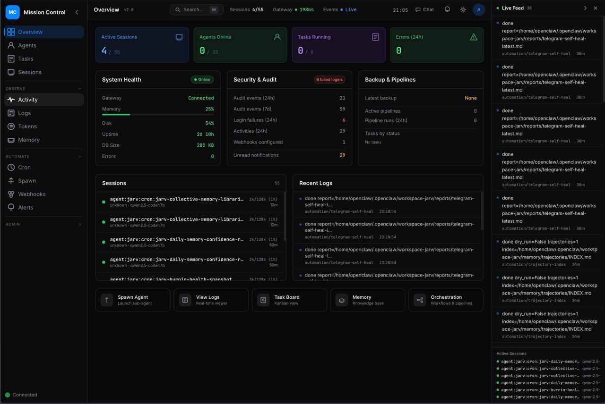

<div align="center">

# Mission Control

**The open-source dashboard for AI agent orchestration.**

Manage agent fleets, track tasks, monitor costs, and orchestrate workflows — all from a single pane of glass.

[](LICENSE)
[](https://nextjs.org/)
[](https://react.dev/)
[](https://typescriptlang.org/)
[](https://sqlite.org/)



</div>

---

> **Alpha Software** — Mission Control is under active development. APIs, database schemas, and configuration formats may change between releases. Review the [known limitations](#known-limitations) and [security considerations](#security-considerations) before deploying to production.

## Why Mission Control?

Running AI agents at scale means juggling sessions, tasks, costs, and reliability across multiple models and channels. Mission Control gives you:

- **26 panels** — Tasks, agents, logs, tokens, memory, cron, alerts, webhooks, pipelines, and more
- **Real-time everything** — WebSocket + SSE push updates, smart polling that pauses when you're away
- **Zero external dependencies** — SQLite database, single `pnpm start` to run, no Redis/Postgres/Docker required
- **Role-based access** — Viewer, operator, and admin roles with session + API key auth
- **Quality gates** — Built-in review system that blocks task completion without sign-off
- **Multi-gateway** — Connect to multiple agent gateways simultaneously (OpenClaw, and more coming soon)

## Quick Start

```bash
git clone https://github.com/builderz-labs/mission-control.git
cd mission-control
pnpm install
cp .env.example .env    # edit with your values
pnpm dev                # http://localhost:3000
```

Initial login is seeded from `AUTH_USER` / `AUTH_PASS` on first run.

## Project Status

### What Works

- Agent management with full lifecycle (register, heartbeat, wake, retire)
- Kanban task board with drag-and-drop, priorities, assignments, and comments
- Real-time monitoring via WebSocket + SSE with smart polling
- Token usage and cost tracking with per-model breakdowns
- Multi-gateway connection management
- Role-based access control (viewer, operator, admin)
- Background scheduler for automated tasks
- Outbound webhooks with delivery history and retry
- Quality review gates for task sign-off
- Pipeline orchestration with workflow templates

### Known Limitations

- **CSP still includes `unsafe-inline`** — `unsafe-eval` has been removed, but inline styles remain for framework compatibility

### Security Considerations

- **Change all default credentials** (`AUTH_USER`, `AUTH_PASS`, `API_KEY`) before deploying
- **Deploy behind a reverse proxy with TLS** (e.g., Caddy, nginx) for any network-accessible deployment
- **Review [SECURITY.md](SECURITY.md)** for the vulnerability reporting process
- **Do not expose the dashboard to the public internet** without configuring `MC_ALLOWED_HOSTS` and TLS

## Features

### Agent Management
Monitor agent status, spawn new sessions, view heartbeats, and manage the full agent lifecycle from registration to retirement.

### Task Board
Kanban board with six columns (inbox → backlog → todo → in-progress → review → done), drag-and-drop, priority levels, assignments, and threaded comments.

### Real-time Monitoring
Live activity feed, session inspector, and log viewer with filtering. WebSocket connection to OpenClaw gateway for instant event delivery.

### Cost Tracking
Token usage dashboard with per-model breakdowns, trend charts, and cost analysis powered by Recharts.

### Background Automation
Scheduled tasks for database backups, stale record cleanup, and agent heartbeat monitoring. Configurable via UI or API.

### Direct CLI Integration
Connect Claude Code, Codex, or any CLI tool directly to Mission Control without requiring a gateway. Register connections, send heartbeats with inline token reporting, and auto-register agents.

### GitHub Issues Sync
Inbound sync from GitHub repositories with label and assignee mapping. Synced issues appear on the task board alongside agent-created tasks.

### Integrations
Outbound webhooks with delivery history, configurable alert rules with cooldowns, and multi-gateway connection management. Optional 1Password CLI integration for secret management.

## Architecture

```
mission-control/
├── src/
│   ├── middleware.ts          # Auth gate + CSRF + network access control
│   ├── app/
│   │   ├── page.tsx           # SPA shell — routes all panels
│   │   ├── login/page.tsx     # Login page
│   │   └── api/               # 30+ REST API routes
│   ├── components/
│   │   ├── layout/            # NavRail, HeaderBar, LiveFeed
│   │   ├── dashboard/         # Overview dashboard
│   │   ├── panels/            # 26 feature panels
│   │   └── chat/              # Agent chat UI
│   ├── lib/
│   │   ├── auth.ts            # Session + API key auth, RBAC
│   │   ├── db.ts              # SQLite (better-sqlite3, WAL mode)
│   │   ├── migrations.ts      # 18 schema migrations
│   │   ├── scheduler.ts       # Background task scheduler
│   │   ├── webhooks.ts        # Outbound webhook delivery
│   │   └── websocket.ts       # Gateway WebSocket client
│   └── store/index.ts         # Zustand state management
└── .data/                     # Runtime data (SQLite DB, token logs)
```

## Tech Stack

| Layer | Technology |
|-------|------------|
| Framework | Next.js 16 (App Router) |
| UI | React 19, Tailwind CSS 3.4 |
| Language | TypeScript 5.7 |
| Database | SQLite via better-sqlite3 (WAL mode) |
| State | Zustand 5 |
| Charts | Recharts 3 |
| Real-time | WebSocket + Server-Sent Events |
| Auth | scrypt hashing, session tokens, RBAC |
| Testing | Vitest + Playwright (165 E2E tests) |

## Authentication

Three auth methods, three roles:

| Method | Details |
|--------|----------|
| Session cookie | `POST /api/auth/login` sets `mc-session` (7-day expiry) |
| API key | `x-api-key` header matches `API_KEY` env var |
| Google Sign-In | OAuth with admin approval workflow |

| Role | Access |
|------|--------|
| `viewer` | Read-only |
| `operator` | Read + write (tasks, agents, chat) |
| `admin` | Full access (users, settings, system ops) |

## API Reference

All endpoints require authentication unless noted. Full reference below.

<details>
<summary><strong>Auth</strong></summary>

| Method | Path | Description |
|--------|------|-------------|
| `POST` | `/api/auth/login` | Login with username/password |
| `POST` | `/api/auth/google` | Google Sign-In |
| `POST` | `/api/auth/logout` | Destroy session |
| `GET` | `/api/auth/me` | Current user info |
| `GET` | `/api/auth/access-requests` | List pending access requests (admin) |
| `POST` | `/api/auth/access-requests` | Approve/reject requests (admin) |

</details>

<details>
<summary><strong>Core Resources</strong></summary>

| Method | Path | Role | Description |
|--------|------|------|-------------|
| `GET` | `/api/agents` | viewer | List agents with task stats |
| `POST` | `/api/agents` | operator | Register/update agent |
| `GET` | `/api/tasks` | viewer | List tasks (filter: `?status=`, `?assigned_to=`, `?priority=`) |
| `POST` | `/api/tasks` | operator | Create task |
| `GET` | `/api/tasks/[id]` | viewer | Task details |
| `PUT` | `/api/tasks/[id]` | operator | Update task |
| `DELETE` | `/api/tasks/[id]` | admin | Delete task |
| `GET` | `/api/tasks/[id]/comments` | viewer | Task comments |
| `POST` | `/api/tasks/[id]/comments` | operator | Add comment |
| `POST` | `/api/tasks/[id]/broadcast` | operator | Broadcast task to agents |

</details>

<details>
<summary><strong>Monitoring</strong></summary>

| Method | Path | Role | Description |
|--------|------|------|-------------|
| `GET` | `/api/status` | viewer | System status (uptime, memory, disk) |
| `GET` | `/api/activities` | viewer | Activity feed |
| `GET` | `/api/notifications` | viewer | Notifications for recipient |
| `GET` | `/api/sessions` | viewer | Active gateway sessions |
| `GET` | `/api/tokens` | viewer | Token usage and cost data |
| `GET` | `/api/standup` | viewer | Standup report history |
| `POST` | `/api/standup` | operator | Generate standup |

</details>

<details>
<summary><strong>Configuration</strong></summary>

| Method | Path | Role | Description |
|--------|------|------|-------------|
| `GET/PUT` | `/api/settings` | admin | App settings |
| `GET/PUT` | `/api/gateway-config` | admin | OpenClaw gateway config |
| `GET/POST` | `/api/cron` | admin | Cron management |

</details>

<details>
<summary><strong>Operations</strong></summary>

| Method | Path | Role | Description |
|--------|------|------|-------------|
| `GET/POST` | `/api/scheduler` | admin | Background task scheduler |
| `GET` | `/api/audit` | admin | Audit log |
| `GET` | `/api/logs` | viewer | Agent log browser |
| `GET` | `/api/memory` | viewer | Memory file browser/search |
| `GET` | `/api/search` | viewer | Global search |
| `GET` | `/api/export` | admin | CSV export |

</details>

<details>
<summary><strong>Integrations</strong></summary>

| Method | Path | Role | Description |
|--------|------|------|-------------|
| `GET/POST/PUT/DELETE` | `/api/webhooks` | admin | Webhook CRUD |
| `POST` | `/api/webhooks/test` | admin | Test delivery |
| `GET` | `/api/webhooks/deliveries` | admin | Delivery history |
| `GET/POST/PUT/DELETE` | `/api/alerts` | admin | Alert rules |
| `GET/POST/PUT/DELETE` | `/api/gateways` | admin | Gateway connections |
| `GET/PUT/DELETE/POST` | `/api/integrations` | admin | Integration management |
| `POST` | `/api/github` | admin | Trigger GitHub Issues sync |

</details>

<details>
<summary><strong>Direct CLI</strong></summary>

| Method | Path | Role | Description |
|--------|------|------|-------------|
| `POST` | `/api/connect` | operator | Register direct CLI connection |
| `GET` | `/api/connect` | viewer | List active connections |
| `DELETE` | `/api/connect` | operator | Disconnect CLI session |

</details>

<details>
<summary><strong>Chat & Real-time</strong></summary>

| Method | Path | Description |
|--------|------|-------------|
| `GET` | `/api/events` | SSE stream of DB changes |
| `GET/POST` | `/api/chat/conversations` | Conversation CRUD |
| `GET/POST` | `/api/chat/messages` | Message CRUD |

</details>

<details>
<summary><strong>Agent Lifecycle</strong></summary>

| Method | Path | Role | Description |
|--------|------|------|-------------|
| `POST` | `/api/spawn` | operator | Spawn agent session |
| `POST` | `/api/agents/[id]/heartbeat` | operator | Agent heartbeat |
| `POST` | `/api/agents/[id]/wake` | operator | Wake sleeping agent |
| `POST` | `/api/quality-review` | operator | Submit quality review |

</details>

<details>
<summary><strong>Pipelines</strong></summary>

| Method | Path | Role | Description |
|--------|------|------|-------------|
| `GET` | `/api/pipelines` | viewer | List pipeline runs |
| `POST` | `/api/pipelines/run` | operator | Start pipeline |
| `GET/POST` | `/api/workflows` | viewer/admin | Workflow templates |

</details>

## Environment Variables

See [`.env.example`](.env.example) for the complete list. Key variables:

| Variable | Required | Description |
|----------|----------|-------------|
| `AUTH_USER` | No | Initial admin username (default: `admin`) |
| `AUTH_PASS` | No | Initial admin password |
| `API_KEY` | No | API key for headless access |
| `OPENCLAW_HOME` | Yes* | Path to `.openclaw` directory |
| `OPENCLAW_GATEWAY_HOST` | No | Gateway host (default: `127.0.0.1`) |
| `OPENCLAW_GATEWAY_PORT` | No | Gateway WebSocket port (default: `18789`) |
| `OPENCLAW_MEMORY_DIR` | No | Memory browser root (see note below) |
| `MC_ALLOWED_HOSTS` | No | Host allowlist for production |

*Memory browser, log viewer, and gateway config require `OPENCLAW_HOME`.

> **Memory Browser note:** OpenClaw does not store agent memory markdown files under
> `$OPENCLAW_HOME/memory/` — that directory does not exist by default. Agent memory lives
> in each agent's workspace (e.g. `~/clawd-agents/{agent}/memory/`). Set
> `OPENCLAW_MEMORY_DIR` to your agents root directory to make the Memory Browser show
> daily logs, `MEMORY.md`, and other markdown files:
> ```
> OPENCLAW_MEMORY_DIR=/home/you/clawd-agents
> ```

## Deployment

```bash
# Build
pnpm install --frozen-lockfile
pnpm build

# Run
OPENCLAW_HOME=/path/to/.openclaw pnpm start
```

Network access is restricted by default in production. Set `MC_ALLOWED_HOSTS` (comma-separated) or `MC_ALLOW_ANY_HOST=1` to control access.

## Development

```bash
pnpm dev              # Dev server
pnpm build            # Production build
pnpm typecheck        # TypeScript check
pnpm lint             # ESLint
pnpm test             # Vitest unit tests
pnpm test:e2e         # Playwright E2E
pnpm quality:gate     # All checks
```

## Roadmap

See [open issues](https://github.com/builderz-labs/mission-control/issues) for planned work and the [v1.0.0 release notes](https://github.com/builderz-labs/mission-control/releases/tag/v1.0.0) for what shipped.

**Completed:**

- [x] Dockerfile and docker-compose.yml ([#34](https://github.com/builderz-labs/mission-control/issues/34))
- [x] Implement session control actions — monitor/pause/terminate are stub buttons ([#35](https://github.com/builderz-labs/mission-control/issues/35))
- [x] Dynamic model catalog — replace hardcoded pricing across 3 files ([#36](https://github.com/builderz-labs/mission-control/issues/36))
- [x] API-wide rate limiting ([#37](https://github.com/builderz-labs/mission-control/issues/37))
- [x] React error boundaries around panels ([#38](https://github.com/builderz-labs/mission-control/issues/38))
- [x] Structured logging with pino ([#39](https://github.com/builderz-labs/mission-control/issues/39))
- [x] Accessibility improvements — WCAG 2.1 AA ([#40](https://github.com/builderz-labs/mission-control/issues/40))
- [x] HSTS header for TLS deployments ([#41](https://github.com/builderz-labs/mission-control/issues/41))
- [x] Input validation with zod schemas ([#42](https://github.com/builderz-labs/mission-control/issues/42))
- [x] Export endpoint row limits ([#43](https://github.com/builderz-labs/mission-control/issues/43))
- [x] Fill in Vitest unit test stubs with real assertions

- [x] Direct CLI integration — connect tools like Codex, Claude Code, or custom CLIs directly without requiring a gateway ([#61](https://github.com/builderz-labs/mission-control/pull/61))
- [x] OpenAPI 3.1 documentation with Scalar UI ([#60](https://github.com/builderz-labs/mission-control/pull/60))
- [x] GitHub Issues sync — inbound sync with label/assignee mapping ([#63](https://github.com/builderz-labs/mission-control/pull/63))

**Up next:**

- [ ] Agent-agnostic gateway support — connect any orchestration framework (OpenClaw, ZeroClaw, OpenFang, NeoBot, IronClaw, etc.), not just OpenClaw
- [ ] Native macOS app (Electron or Tauri)
- [ ] First-class per-agent cost breakdowns — dedicated panel with per-agent token usage and spend (currently derivable from per-session data)
- [ ] Webhook retry with exponential backoff
- [ ] OAuth approval UI improvements
- [ ] API token rotation UI
- [ ] Webhook signature verification

## Contributing

Contributions are welcome. See [CONTRIBUTING.md](CONTRIBUTING.md) for setup instructions and guidelines.

## Security

To report a vulnerability, see [SECURITY.md](SECURITY.md).

## License

[MIT](LICENSE) © 2026 [Builderz Labs](https://github.com/builderz-labs)
